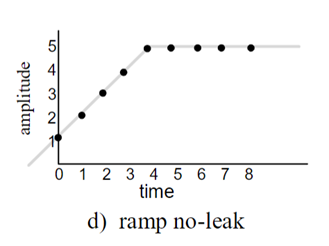
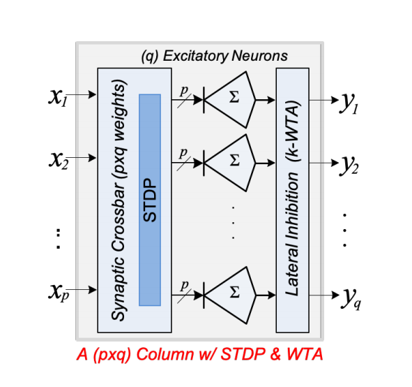

# TSUC: TNN simulator using CUDA

## Summary

We are going to build a Temporal Neural Network (TNN) simulator on GHC’s CUDA GPUs and run MNIST on it. The model will be based on 18743 (Neuromorphic Computer Architecture & Processor Design) lab assignment 1’s pytorch model. And it will be parameterized in 3 or 4 levels of abstractions: 1. the number of synapses per neuron, 2. the number of neurons per macro-column, 3. the number of macro-columns per layer, 4. possibly the number of layers in the entire TNN.

## Background

**Temporal Neural Network** is a biomorphic neural network architecture that uses the difference in the arrival time of the signals to encode the magnitude of the signal. The relative arrival time of a signal (called ‘spike’ in this context) from a synapse is combined with the synapse weight and then contributes to the body potential of the neuron which the synapse belongs to. And when a neuron’s body potential reaches a threshold, the neuron will fire a spike at that time. The neuron’s body potential will reset once a while (for a few clock cycles), and this is called a ‘gamma cycle’.

The output function of a synapse in our model follows the Ramp-No-Leak (RNL) function. It does not immediately add the whole weight to the body potential of the neuron, but instead adds 1 to the body potential every clock cycle and stops after weight cycles.

The weight on a synapse is trained according to the spike-timing dependent plasticity model (STDP). This means that if the synapse receives a spike before the neuron fires a spike in a gamma cycle, the weight is strengthened, otherwise weakened.

Multiple neurons that have their synapses connected to the same set of inputs form a macro-column. In each macro-column, a winner-takes-all operation is performed over all the neurons: once a neuron fires a spike, the macro-column will pass down that spike and inhibit other neurons from firing in that gamma cycle.

Multiple macro-columns form a layer. The TNN consists of multiple layers. In our model, we will start from 3 layers.

## Workload

In terms of memory access pattern, in simulating each macro-column, we need to find out the min firing time among the neurons to perform WTA operation. This certainly has a communication between threads. Hopefully, we can limit those in a single block using shared memory.

And at the layer level, spiking times will be passed between the layers. And since we are not sure how the layers are simulated, we cannot make much assumptions on its memory access characteristics. But we are at least sure that this data should be put in some place where we can have quick access to (and possibly discarded right after use for space).

Moreover, the synapse weights should certainly stay in some fast access memory on the GPU to be easily checked and updated.

In terms of divergent execution, we are certain that WTA will cause a lot of divergence because only the winning neuron in each macro-column passes out its spike, and this seems to be an obvious divergence. We need to think more about the model and start working on it to learn more about where divergence can happen.

## Constraints

Since the size (parameters) of our model should be generalizable, we should consider how the change of size affects the workload mapping. On a CUDA platform, the size of shared memory in each block is limited, and we should consider how to make good use of these. Moreover, there is also the problem that during weight update, different synapses in different neurons may update in different ways, causing a lot of divergence.

Also, since not every clock cycle has an input spike, how to skip the cycles without input spikes is also a question to think about. We don’t want to waste computation time on simulating the clock cycles when nothing happens.

## Resources

We have the GHC machines almost always ready for us to use. This is a great benefit. Also, we have the base-line pytorch model from 18743 to use as a reference. We are also using MNIST, which is a well-studied dataset for testing purposes.

We are not sure if there are past implementations of such simulators in CUDA.

## Goals and Deliverables

In the end, we should have a TNN simulator that allows setting a few parameters and can then be trained over an input dataset and perform inference. It should have no less than 5x speedup over the PyTorch model when running on the same GPUs. Since PyTorch already supports CUDA acceleration, we don’t expect a lot of speedup. The speedup should probably come mainly from fusing different potential kernel launches in the PyTorch model together.

It will be good if we can have a better speedup (like 10x), but we think our model can be more ‘cycle-accurate’ than the PyTorch model. That’s probably the most important part. We can accept that if our model has a lower speedup, but it should not slow down.

And in terms of TNN training time and inference accuracy, it should not be too different from the PyTorch model.

## Platform Choice

We choose to use GHC machines’ CUDA GPUs to accelerate our model.

The main reason is that we think the SPMD model is very suitable for simulating the large number of parallel synapses in the neuron macro-columns: In each macro-column, the neurons and their synapses are performing calculations in sync with the ‘gamma wave’. And we think the way threads within a block executes in lock-steps is intuitively very similar to the way the neurons work in a macro-column. This similarity makes us think using CUDA GPUs to simulate our TNN model is a good choice.

A minor reason is that GHC machines’ CUDA GPUs are platforms easily available to us and we have enough experience programming the model. This could save a lot of burdens in trying to understand a new platform.

## Tentative Schedule

Assuming 5 weeks left:

### Week 1

(Mar27 - Apr02) Theoretical designs. Basic single neuron implementation should be supported. It should have a parameterized number of synapses.

### Week 2

(Apr03 - Apr09) Macro-column implementation should be supported. It should have a parameterized number of neurons.

### Week 3

(Apr10 - Apr11) Milestone report.

(Apr12 - Apr16) Single unsupervised layer implemention should be complete.

### Week 4

(Apr17 - Apr20) Add MNIST data loader, perform test over a single column unsupervised layer, and evaluate the speedup and accuarcy.

(Apr21 - Apr23) Add reinforcement learning to the single layer model, test and evaluate.

### Week 5

(Apr24 - Apr27) Wrap up, write the report, nice to support more than 1024 synpases for each column, and nice to support k-WTA.

(Apr28 - Apr30) Wrap up, write the report, nice to print out the trained weights of neurons as images.

### Week 6

(May01 - May05) Wrapping up, demo, and writing report.

## Milestone

### Current Progress

<!-- Describe how you are doing with respect to the goals and deliverables stated in your proposal. Do you still believe you will be able to produce all your deliverables? If not, why? What about the "nice to haves"? In your milestone writeup we want an updated list of goals that you plan to hit for the poster session. -->
As of April 4th, we've completed the implementation of the column layer without reinforcement. The kernel computes the neuron outputs for a whole column layer for a batch of input pre-translated data in delay encoding. The effects over all the synapses and neuron bodies in the layer are computed in parallel.
<!-- Do you have preliminary results at this time? If so, it would be great to included them in your milestone write-up. -->
We currently don't have any preliminary results yet. We expect to have some results by end of week 3.
We believe we will be able to produce all our deliverables. We are also on track for the "nice to haves".

<!-- List the issues that concern you the most. Are there any remaining unknowns (things you simply don't know how to solve, or resource you don't know how to get) or is it just a matter of coding and doing the work? If you do not wish to put this information on a public web site you are welcome to email the staff directly. -->
There is the limitation that the total number of synapse * neurons in a column is <= 1024 due to limitation of thread per block in CUDA. The implementation is not tested yet.

<!-- What do you plan to show at the poster session? Will it be a demo? Will it be a graph? -->
For poster session, we plan to show a graph of error rates to show how fast our model can converge when variance happen in the input dataset. It is going to be a demo using MNIST dataset. It is also nice if we can have an image that shows the trained weights on each synapse to show what features are learned by our model. We would also want to compare our model against a baseline PyTorch model.
